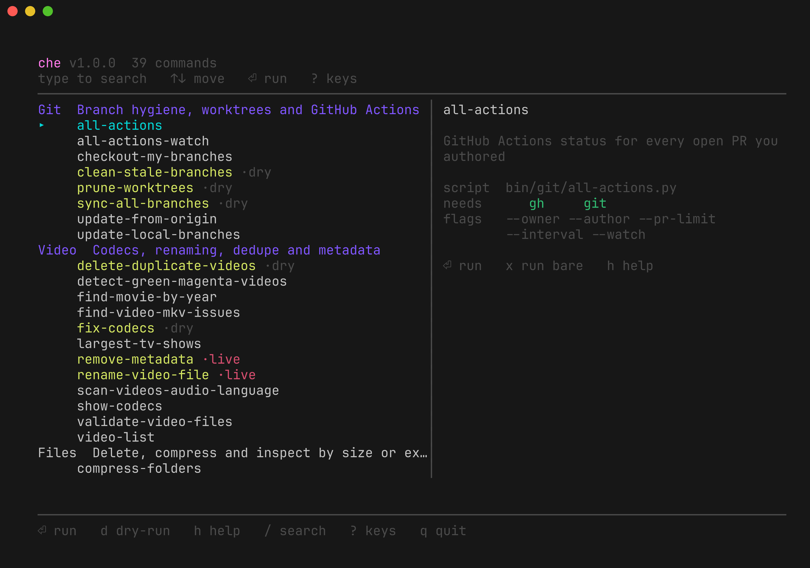
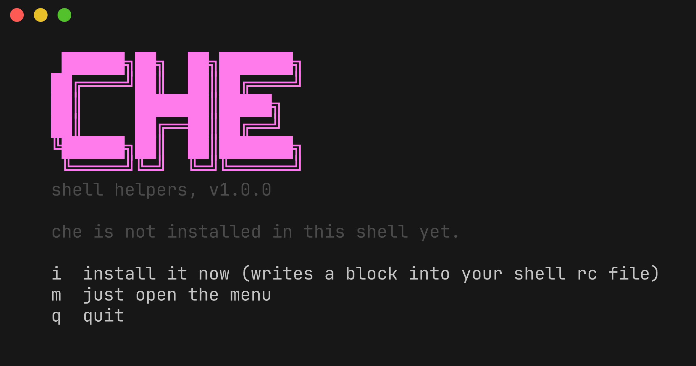
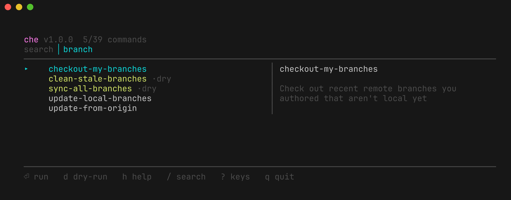
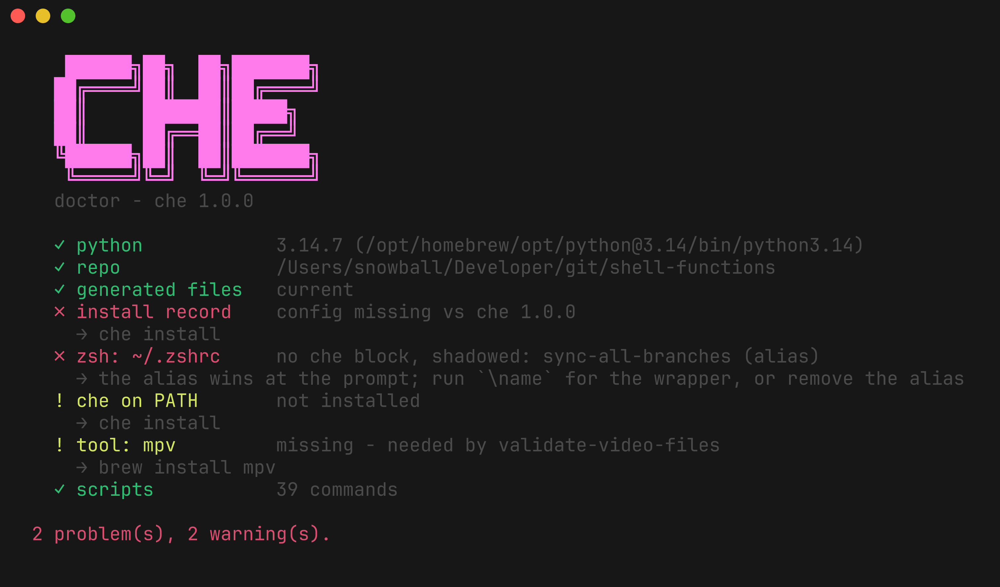

<div align="center">

# `che`

**A collection of helper scripts shared amongst computers, called by name from
your shell, and browsable through one menu.**

[](https://github.com/codebend3r/che/actions/workflows/ci.yml)




</div>

The scripts are Python, standard library only. The names you type
(`delete-by-ext`, `sync-all-branches`, `show-codecs`, …) are shell functions
generated from one manifest, `bin/commands.py`, and installed into whichever
shells you use.

```
che                     browse everything: type to filter, Enter to run
che <command> [args…]   run one directly
delete-by-ext --path=…  or just call it by name
```

<!-- che:count -->
33 commands across 5 categories, plus 6 built into `che` itself
<!-- /che:count -->

## Highlights

- **One manifest, everything generated.** Wrappers, completions, the menu, the
  doctor report and the tables in this README all come from `bin/commands.py`;
  `bun run ci` fails if any of them drift.
- **Destructive commands preview by default.** Every deleter has a `-dr` twin
  that only prints, and the menu opens on the dry-run.
- **Standard library only.** A bare `python3` 3.12+ runs everything; no venv,
  no `pip install`, on any machine the repo is cloned to.
- **Your dotfiles stay yours.** The installer writes a few lines between
  markers, backs every rc file up first, and never touches anything outside
  the markers.
- **`che doctor` knows the whole story.** Interpreter, generated files, rc
  blocks, external tools, alias collisions — one command, non-zero on failure.

## Install

From a clone:

```sh
git clone https://github.com/codebend3r/che.git ~/Developer/git/che
~/Developer/git/che/install.sh
```

Or in one line, which clones for you (into `~/Developer/git/shell-functions`,
or wherever `CHE_HOME` points):

```sh
curl -fsSL https://raw.githubusercontent.com/codebend3r/che/main/install.sh | bash
```

`install.sh` finds a suitable python3, then hands over to `bin/install.py`,
which opens a first-run wizard: it lists the shells it found and the rc files
it would touch, asks whether to add a `che` on `PATH` and whether to keep the
completion chimes, offers to remove hand-written wrappers left over from before
the installer existed, and reports any missing external tool (offering to
`brew install` them when Homebrew is present).

<div align="center">

<br>
<em>Running <code>che</code> before installing offers to set itself up.</em>
</div>

Skip the wizard:

```sh
./install.sh --yes                    # into the shells it detects
./install.sh --yes --shells=zsh,fish  # or the ones you name
./install.sh --dry-run                # report what would change, write nothing
./install.sh --yes --replace-legacy   # also remove pre-che hand-written wrappers
./install.sh --print                  # print the rc block, install nothing
```

Every rc file is copied to `~/.config/che/backups/` before it is edited.

### What lands where

| Thing | Where |
| --- | --- |
| The rc block, six or seven lines between markers | `~/.zshrc` (or `$ZDOTDIR/.zshrc`), `~/.bashrc` and `~/.bash_profile` (whichever exist), `~/.config/fish/config.fish`, and `~/.profile` only if you ask for `sh` |
| The wrappers themselves | `shell/che.zsh`, `shell/che.bash`, `shell/che.fish` in this repo |
| Tab completions | `shell/completions/`, sourced by the same wrapper file |
| A `che` executable, for cron and scripts that never read an rc file | `~/.local/bin/che` |
| What you answered | `~/.config/che/config.json` |

The block itself is small on purpose, so upgrading che never rewrites your
dotfiles:

```zsh
# >>> che shell functions >>>
# Managed by `che install` (che 1.0.0). Edits here are overwritten.
export CHE_HOME=/Users/you/Developer/git/shell-functions
export CHE_PYTHON=/opt/homebrew/bin/python3
[ -r /Users/you/Developer/git/shell-functions/shell/che.zsh ] && . /Users/you/Developer/git/shell-functions/shell/che.zsh
case ":$PATH:" in *":/Users/you/.local/bin:"*) ;; *) PATH="/Users/you/.local/bin:$PATH" ;; esac
# <<< che shell functions <<<
```

Everything between those markers belongs to `che install` and is rewritten on
every install. Everything outside them is yours and is never touched.

Then reload:

```sh
exec zsh          # or exec bash / exec fish
```

**Requires Python 3.12+** and nothing else to run the scripts. The installer
picks the newest suitable interpreter it can find and records its path in the
block, so an old `/usr/bin/python3` does not matter as long as some newer
python3 exists. `brew install python@3.13` if none does.

### Uninstall

```sh
che uninstall           # remove the block, the shim and the completions
che uninstall --purge   # also delete ~/.config/che
```

The repo itself is left alone; delete the directory to finish.

## Using it

`che` on its own opens the menu. Anything that can preview **previews by
default**, so pressing Enter on `delete-by-ext` shows you what it would delete
rather than deleting it.

Type to filter — the list narrows as you go, and the right pane always shows
the selected command's summary, script, required tools and flags:

<div align="center">

</div>

<!-- che:keys -->
| Key | Does |
| --- | --- |
| `↑ ↓ / j k` | move |
| `PgUp PgDn / g G` | jump |
| `⏎` | run (asks for arguments) |
| `x` | run with no arguments |
| `d` | toggle dry-run for this command |
| `h` | show the command's own --help |
| `/` | search, Esc to clear |
| `?` | this list |
| `q` | quit |
<!-- /che:keys -->

Every command is also a plain shell function, so `type delete-by-ext` shows
exactly what it runs, and the destructive ones have a `-dr` twin that only
prints:

```sh
delete-by-ext --path=/Volumes/Media --ext=nfo,txt   # deletes
delete-by-ext-dr --path=/Volumes/Media --ext=nfo    # shows what it would delete
```

`che <command>` runs the same thing with the same environment the wrapper would
have used, and `che help <command>` prints that script's own `--help`.

### Commands

<!-- che:commands -->
| Command | Does | Preview |
| --- | --- | --- |
| **Git** | *Branch hygiene, worktrees and GitHub Actions* | |
| `all-actions` | GitHub Actions status for every open PR you authored |  |
| `all-actions-watch` | Same as all-actions, refreshed on an interval |  |
| `checkout-my-branches` | Check out recent remote branches you authored that aren't local yet |  |
| `clean-stale-branches` | Delete local branches whose upstream is gone | `clean-stale-branches-dr` |
| `prune-worktrees` | Remove every linked worktree, then prune stale admin records | `prune-worktrees-dr` |
| `sync-all-branches` | Push every worktree, collapse the pushed ones, then tidy branches | `sync-all-branches-dr` |
| `update-from-origin` | Same as sync-all-branches but never pushes: fetch, collapse, rebase |  |
| `update-local-branches` | Rebase every local branch that has an upstream onto origin | `--dry-run` |
| **Video** | *Codecs, renaming, dedupe and metadata* | |
| `show-codecs` | Report media files outside the Direct Play codec/container set |  |
| `fix-codecs` | Re-encode media to h265/aac mp4 so it Direct Plays | `fix-codecs-dr` |
| `find-video-mkv-issues` | Scan MKV files and estimate Plex direct-play compatibility |  |
| `validate-video-files` | Check .mp4/.mkv files decode by playing one frame with mpv |  |
| `scan-videos-audio-language` | Print the audio language tags of every video under a path |  |
| `remove-metadata` | Strip all metadata from video files recursively | none |
| `rename-video-file` | Title-case video filenames (and optionally their folders) | `--dry-run` |
| `delete-duplicate-videos` | Delete duplicate MKV/MP4 files under a root directory | `delete-duplicate-videos-dr` |
| `video-list` | List .mp4/.mkv files under a path with human-readable sizes |  |
| `detect-green-magenta-videos` | Detect videos with the green/magenta chroma artifact |  |
| `find-movie-by-year` | Find movie folders whose name ends with "(YYYY)" |  |
| `largest-tv-shows` | Rank TV show folders in a library by total size on disk |  |
| **Files** | *Delete, compress and inspect by size or extension* | |
| `delete-by-ext` | Delete files under a path matching a set of extensions | `delete-by-ext-dr` |
| `delete-empty-folders` | Delete truly-empty directories under a path, cascading upwards | `delete-empty-folders-dr` |
| `delete-smb-files` | Delete .smbdelete* files left behind by an SMB share | `delete-smb-files-dr` |
| `files-under-size` | Find video files at or under a size threshold | `files-under-size-dr` |
| `find-largest-files` | List the largest files under a path, biggest first |  |
| `make-alpha-dir` | Create '#' and A-Z bucket folders under a parent directory |  |
| `compress-folders` | Zip every immediate subfolder of a path at max compression | `--dry-run` |
| `list-permission` | Show ownership and mode of a volume under /Volumes |  |
| **Drives** | *Mount, eject and keep-alive for the NAS volumes* | |
| `mount-all-drives` | Mount all NAS drives over SMB via AppleScript |  |
| `eject-all-drives` | Eject all NAS volumes from /Volumes | `eject-all-drives-dr` |
| `ping-nas` | Keep-alive pinger that remounts a NAS drive that dropped off |  |
| **System** | *Homebrew, monitoring and the machine itself* | |
| `update-brew` | Update Homebrew, upgrade formulae and casks, then clean up | `update-brew-dr` |
| `btop` | Launch btop with a gruvbox theme matching the macOS appearance |  |
<!-- /che:commands -->

Two commands have no `-dr` twin. `remove-metadata` cannot preview at all, since
exiftool rewrites in place. `rename-video-file` does not need one: it already
defaults to `--dry-run=true`, so the real rename is the one that needs
`--dry-run=false`.

### Managing the install

<!-- che:builtins -->
| Command | Does |
| --- | --- |
| `che install` | Install the shell wrappers into your shell startup files |
| `che update` | Pull the latest scripts and refresh the installed wrappers |
| `che doctor` | Check the install, the interpreter and every external tool |
| `che uninstall` | Remove the wrappers, the shim and the completions |
| `che list` | List every command, one per line |
| `che completions` | Print the completion script for a shell |
<!-- /che:builtins -->

`che doctor` checks the interpreter, the repo, whether the generated files are
current, whether each rc file has the block, whether `che` is on `PATH`, every
external tool, and anything shadowing a wrapper. It exits non-zero on a real
failure, so it works in a health check. `che doctor --json` for a machine.

<div align="center">

<br>
<em>Every problem <code>che doctor</code> reports comes with the command that fixes it.</em>
</div>

### Environment

| Variable | Effect |
| --- | --- |
| `CHE_HOME` | Where this repo lives. Set by the block; the wrapper file falls back to its own location. |
| `CHE_PYTHON` | Interpreter the wrappers use. Set by the block to the one the installer verified. |
| `CHE_SOUNDS` | `0` turns off the `playsound-N` chime after every command. |
| `DRY_RUN` | What the wrappers set for the destructive commands. Exporting it yourself changes nothing for them, since the wrapper sets it explicitly on every call; it only reaches a script invoked directly. |
| `NO_COLOR` | Honoured by every script and by the menu. |

## How it fits together

`bin/commands.py` is the single source of truth. The wrappers, the completions,
the menu, the `doctor` report and the tables in this README are all generated
from it, and `bun run ci` fails if any of them drift.

### Adding a command

1. Write the script under `bin/<category>/` and `chmod +x` it.
2. Add a `Command(...)` to `bin/commands.py`: name, summary, script, sound,
   whether it can preview, which external tools it needs, its flags, and the
   two or three questions the menu should ask.
3. `bun run generate` to rewrite `shell/` and this README's tables, and commit
   the result.
4. `che install` on each machine, or `che update`, which does both.

There is no step where you hand-edit a wrapper into `~/.zshrc`, and no step
where you copy one machine's rc file to another.

### Layout

```
bin/
  che.py              the dispatcher and the interactive menu
  commands.py         the command manifest: the source of truth for everything
  install.py          installer, first-run wizard, doctor, self-update
  shellgen.py         renders the wrappers, completions and README tables
  tui.py              terminal primitives: raw input, frame buffer, prompts
  utils.py            shared library: logging, arg parsing, subprocess, files
  drives/             mount, eject, and keep-alive for the NAS volumes
  files/              delete/compress/inspect files by extension or size
  git/                branch hygiene, worktrees, GitHub Actions status
  system/             Homebrew updates, btop launcher
  video/              codec inspection, renaming, dedupe, metadata
shell/                GENERATED wrappers and completions, do not edit
test/                 pytest suites
install.sh            bootstrap for a machine with nothing on it
.zshrc                a shim that sources shell/che.zsh, kept for old setups
```

## CLI conventions

Every script follows the same shape, described in full at the top of
`bin/utils.py`:

- **Long flags only**, `--name=value` for values.
- **Booleans** accept a bare `--flag` *and* `--flag=true|false` (plus
  `yes|no`, `1|0`, `on|off`). A bare `--flag` never swallows the next argument.
- **`--help`** on every script.
- **Destructive scripts default to dry-run.** `delete-by-ext`,
  `delete-empty-folders`, `delete-smb-files`, `files-under-size`, `fix-codecs`,
  `delete-duplicate-videos` and `prune-worktrees` read `DRY_RUN` and preview
  unless told otherwise; the generated wrapper sets `DRY_RUN=false` for the
  real thing and the `-dr` twin sets it back to `true`.
- **A symlinked `--path` is refused.** `find` never followed a symlinked start
  point, so pointing a delete tool at `~/media -> /Volumes/...` used to be a
  silent no-op. Pass the real path to act on it.

## Syncing branches and worktrees

```sh
sync-all-branches       # push every worktree, collapse the pushed ones, then sync
sync-all-branches-dr    # preview only
update-from-origin      # same, but --no-push: only collapses already-pushed worktrees
```

A worktree is a temporary workspace. Once its commits are on origin the
directory holds nothing the remote doesn't, so `sync-all-branches` pushes it,
removes the directory, and leaves the branch behind as an ordinary local
branch. That also clears the `already used by worktree` pin, which is what
otherwise makes `main` un-checkoutable and stale branches un-deletable.

A worktree is only collapsed when it is **clean** *and* **fully pushed**.
Anything else is kept and reported with the reason.

## External tools

The scripts shell out to these where relevant and fail with an install hint
when one is missing. `che doctor` reports which are present and what needs
them.

<!-- che:tools -->
| Tool | Needed by |
| --- | --- |
| `brew` | `update-brew` |
| `btop` | `btop` |
| `diskutil` | `eject-all-drives` |
| `exiftool` | `remove-metadata` |
| `ffmpeg` | `fix-codecs` |
| `ffprobe` | `show-codecs`, `find-video-mkv-issues`, `scan-videos-audio-language` |
| `gh` | `all-actions`, `all-actions-watch` |
| `git` | `all-actions`, `all-actions-watch`, `checkout-my-branches`, `clean-stale-branches`, `prune-worktrees`, `sync-all-branches`, `update-from-origin`, `update-local-branches`, `update` |
| `mpv` | `validate-video-files` |
| `osascript` | `mount-all-drives` |
| (not a binary) | `detect-green-magenta-videos` needs OpenCV in ~/.venvs/green-magenta (override with $DETECT_GM_PYTHON) |
<!-- /che:tools -->

`diskutil` and `osascript` ship with macOS. The rest are one `brew install`
away, and `che install --install-deps` will do it for you.

`playsound-N`, the chime a wrapper plays when it finishes, is defined outside
this repo. When it is absent the wrappers skip it silently; `CHE_SOUNDS=0`
turns the chimes off everywhere.

`zip`, `bc`, `jq`, `perl`, `awk` and `sort` are no longer needed: `zipfile`,
integer maths, `json`, `re` and `sorted()` cover what they were doing.

## Running tests

This repo uses [Bun](https://bun.sh) as its task runner and
[uv](https://docs.astral.sh/uv/) to supply the dev tooling.

```sh
bun run test        # pytest
bun run generate    # rewrite shell/ and this README's tables from the manifest
bun run ci          # ruff + syntax + exec bits + shebangs + generated files + pytest
```

Neither `pytest` nor `ruff` needs to be installed globally: the scripts shell
out to `uv run --with-requirements requirements-dev.txt`, which builds an
ephemeral environment per invocation. Versions are pinned exactly in
`requirements-dev.txt`.

(Note: plain `bun test` invokes Bun's built-in JS/TS test runner, which doesn't
apply here, so always use `bun run test`.)

## Troubleshooting

**A command still runs the old thing.** An alias beats a function in both zsh
and bash. The wrappers stash a colliding alias, define themselves, then put the
alias back, so your alias keeps winning at the prompt exactly as before; run
`\name` (backslash) to reach the wrapper, or remove the alias. `che doctor`
lists every collision it finds.

**`che: command not found` in a script or cron job.** Those never read an rc
file. Use `~/.local/bin/che`, which the installer puts on `PATH`.

**A wrapper is missing after an update.** `che update` regenerates and
reinstalls; `che doctor` says whether `shell/` is stale or the block is out of
date.

**Old hand-written wrappers are still in your rc file.** `che doctor` counts
them; `che install --replace-legacy` removes them, their helpers and the lines
that called them, after a backup.

## History

These scripts were bash until August 2026. `git log` has the shell versions;
the migration commit explains each deliberate behavioural change, and anywhere
the Python intentionally differs from the bash it replaced, there is a comment
at that line saying so.

The wrappers were hand-maintained in this repo's `.zshrc` until `che` arrived,
with the documented workflow being to copy them into `~/.zshrc` by hand. That
is what `che install --replace-legacy` cleans up.
